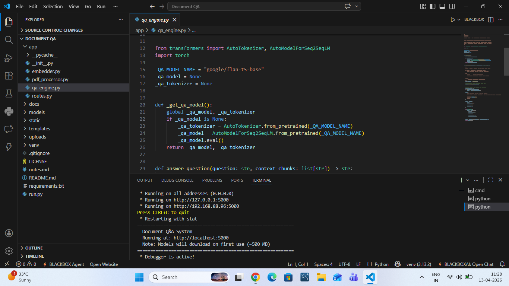
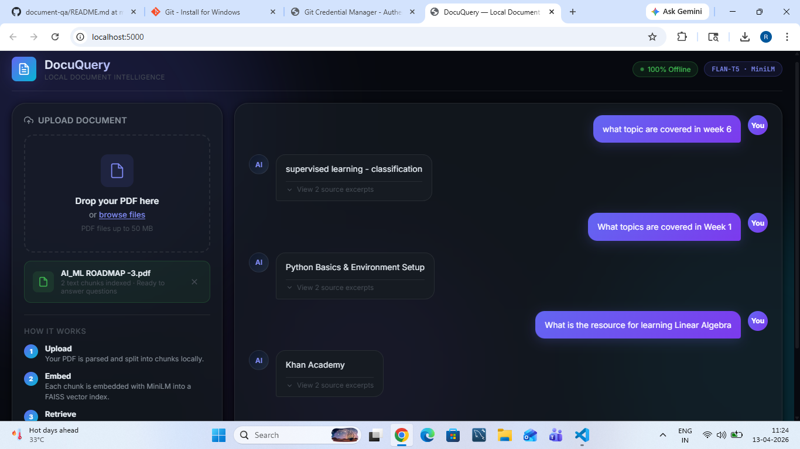

# DocuQuery — Local Document Q&A System

<div align="center">


**Ask questions about any PDF — entirely on your machine. No API keys. No internet. No data leaves your device.**

[](https://python.org)
[](https://flask.palletsprojects.com)
[](https://huggingface.co/google/flan-t5-base)
[](LICENSE)

</div>

---

## Table of Contents

- [Overview](#overview)
- [Demo](#demo)
- [Architecture](#architecture)
- [Tech Stack](#tech-stack)
- [Project Structure](#project-structure)
- [Setup & Installation](#setup--installation)
- [Usage](#usage)
- [Design Decisions](#design-decisions)
- [Limitations](#limitations)
- [License](#license)

---

## Overview

DocuQuery is a **fully local** Retrieval-Augmented Generation (RAG) system. Upload any PDF and immediately start asking natural language questions about it. Every step — parsing, embedding, retrieval, and answer generation — runs on your own hardware.

**Key guarantees:**
- ✅ Zero external API calls
- ✅ Works offline after first model download
- ✅ Answers are grounded only in the uploaded document
- ✅ No document data is stored after the session ends

---

## Demo

### Screenshots

| Upload Screen | Q&A in Action |
|:---:|:---:|
| | |

> **Video demo:** See [`docs/demo.mp4`](docs/demo.mp4) for a full walkthrough.

---

## Architecture

```
┌─────────────────────────────────────────────────────────────────┐
│                        User Browser                              │
│          Drag & drop PDF  ──►  Ask question in chat             │
└────────────────────┬────────────────────────┬───────────────────┘
                     │ POST /upload            │ POST /ask
                     ▼                         ▼
┌─────────────────────────────────────────────────────────────────┐
│                      Flask Backend                               │
│                                                                  │
│  ┌──────────────┐   ┌─────────────────┐   ┌─────────────────┐  │
│  │ pdf_processor│   │    embedder      │   │   qa_engine     │  │
│  │              │   │                  │   │                 │  │
│  │ PyMuPDF      │──►│ MiniLM-L6-v2    │   │ FLAN-T5-base   │  │
│  │ Text extract │   │ FAISS FlatL2    │──►│ Prompt → Answer │  │
│  │ Chunking     │   │ Similarity search│   │                 │  │
│  └──────────────┘   └─────────────────┘   └─────────────────┘  │
└─────────────────────────────────────────────────────────────────┘
```

### RAG Pipeline

```
PDF
 │
 ▼
Text Extraction (PyMuPDF)
 │
 ▼
Chunking — 500-word windows, 50-word overlap
 │
 ▼
Embed each chunk → all-MiniLM-L6-v2 (384-dim vectors)
 │
 ▼
FAISS FlatL2 index (exact nearest-neighbor search)
 │
 ▼  ◄─── User question (also embedded by MiniLM)
Top-5 most relevant chunks retrieved
 │
 ▼
FLAN-T5-base: "Answer based only on this context…"
 │
 ▼
Answer + source excerpts displayed in UI
```

---

## Tech Stack

| Component | Technology | Rationale |
|---|---|---|
| **Web Framework** | Flask 2.3 | Lightweight, no build step, easy to extend |
| **PDF Parsing** | PyMuPDF (fitz) | Fast, handles most PDF layouts reliably |
| **Embedding Model** | `sentence-transformers/all-MiniLM-L6-v2` | 22M params, 384-dim, excellent quality/speed tradeoff |
| **Vector Search** | FAISS FlatL2 | Exact search, no server, pure Python/C++ |
| **Answer Model** | `google/flan-t5-base` | 250M params, instruction-tuned, runs well on CPU |
| **Frontend** | Vanilla HTML/CSS/JS | No build toolchain, instant load |

---

## Project Structure

```
Document QA/
├── app/
│   ├── __init__.py          # Flask app factory
│   ├── routes.py            # /upload and /ask endpoints
│   ├── pdf_processor.py     # PDF parsing & text chunking
│   ├── embedder.py          # MiniLM embeddings + FAISS index
│   └── qa_engine.py         # FLAN-T5 answer generation
│
├── static/
│   ├── css/style.css        # Dark glassmorphism UI styles
│   └── js/main.js           # Upload & chat interaction logic
│
├── templates/
│   └── index.html           # Single-page application shell
│
├── docs/                    # Screenshots and demo video
├── uploads/                 # Temporary PDF storage (auto-cleaned, gitignored)
├── models/                  # HuggingFace model cache (gitignored)
│
├── run.py                   # Application entry point
├── requirements.txt         # Python dependencies
├── .gitignore
└── README.md
```

---

## Setup & Installation

### Prerequisites

- **Python 3.10 or higher** — [Download](https://python.org/downloads)
- **pip** (comes with Python)
- ~1.5 GB free disk space for model downloads (one-time)

### Step 1 — Clone the repository

```bash
git clone https://github.com/your-username/document-qa.git
cd "document-qa"
```

### Step 2 — Create a virtual environment

```bash
# Windows
python -m venv venv
venv\Scripts\activate

# macOS / Linux
python3 -m venv venv
source venv/bin/activate
```

### Step 3 — Install dependencies

```bash
pip install -r requirements.txt
```

> **Note:** This installs PyTorch (CPU build), sentence-transformers, FAISS, and transformers. Total download ~800 MB.

### Step 4 — Run the application

```bash
python run.py
```

Open your browser at **http://localhost:5000**

> **First run:** The embedding model (`all-MiniLM-L6-v2`, ~90 MB) and QA model (`flan-t5-base`, ~900 MB) are downloaded automatically from HuggingFace and cached locally. This takes a few minutes once only.

### Step 5 — Use the app

1. Drag & drop (or click to browse) a PDF file
2. Wait for the "Ready" confirmation (~5–30 seconds depending on PDF size)
3. Type your question and hit **Enter**
4. View the answer and expand "source excerpts" to see which parts of the document were used

---

## Usage

### API Endpoints

| Method | Endpoint | Description |
|---|---|---|
| `GET` | `/` | Serve the web UI |
| `POST` | `/upload` | Upload and index a PDF |
| `POST` | `/ask` | Ask a question about the indexed PDF |

#### `POST /upload`

```
Content-Type: multipart/form-data
Body: file = <PDF file>
```

**Response:**
```json
{
  "session_id": "uuid-string",
  "filename": "document.pdf",
  "chunk_count": 142,
  "message": "Document processed successfully."
}
```

#### `POST /ask`

```json
{
  "session_id": "uuid-string",
  "question": "What are the main conclusions?"
}
```

**Response:**
```json
{
  "answer": "The main conclusions are...",
  "sources": ["...chunk 1...", "...chunk 2...", "...chunk 3..."]
}
```

---

## Design Decisions

### Why RAG instead of fine-tuning?

RAG (Retrieval-Augmented Generation) is ideal here because:
- No training required — works on any document immediately
- Answers are constrained to the document content (less hallucination)
- New documents can be indexed in seconds

### Why FLAN-T5 instead of LLaMA/Mistral?

FLAN-T5-base (250M params) runs in ~2–5 seconds per query on CPU without quantization. Larger models like LLaMA-3.2 require either a GPU or quantization setup, adding complexity. FLAN-T5 is instruction-tuned and produces coherent, grounded answers for document QA tasks.

### Why FAISS FlatL2 instead of approximate search?

For document-sized corpora (typically < 5,000 chunks), exact search with FlatL2 is faster than approximate methods like HNSW due to no index-build overhead and negligible query latency at that scale.

### Chunking strategy

500-word chunks with a 50-word overlap ensure:
- Chunks are small enough to fit in the LLM context
- Context at chunk boundaries is not lost
- Semantically related sentences stay together

---

## Limitations

- **Scanned PDFs** (image-based) are not supported — PyMuPDF requires selectable text. For scanned PDFs, an OCR step (e.g., `pytesseract`) would need to be added.
- **Very large PDFs** (100+ pages) may take 30–60 seconds to index on first upload.
- **Tables and figures** are extracted as raw text, which may reduce answer quality for numeric/visual content.
- **Multi-turn conversation** is not supported — each question is answered independently against the full document.
- **Answer quality** depends on FLAN-T5-base; a larger model (e.g., flan-t5-large) would improve accuracy at the cost of speed.

---

## License

MIT License — see [LICENSE](LICENSE) for details.
